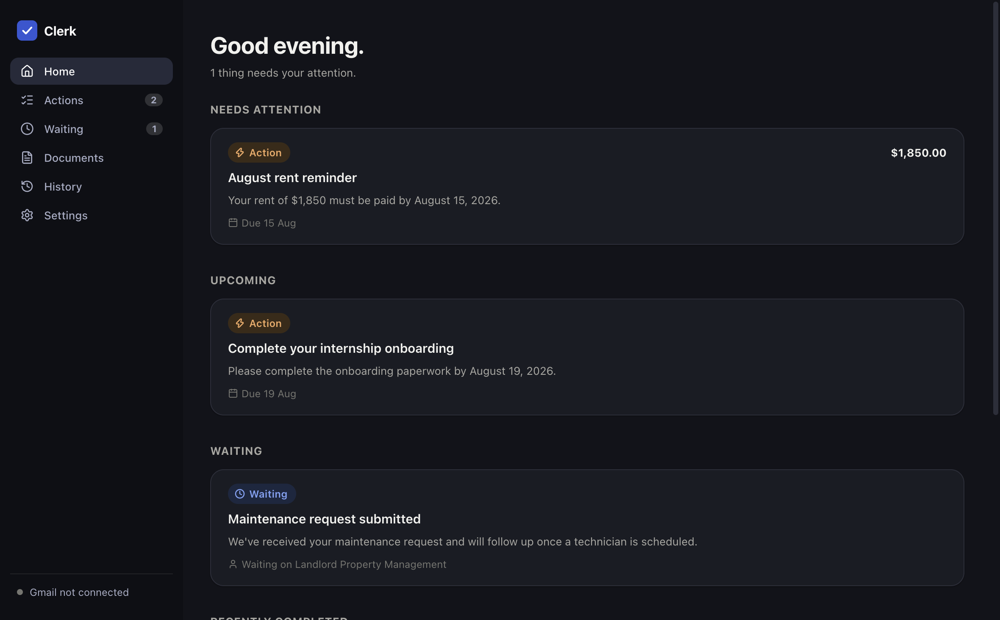
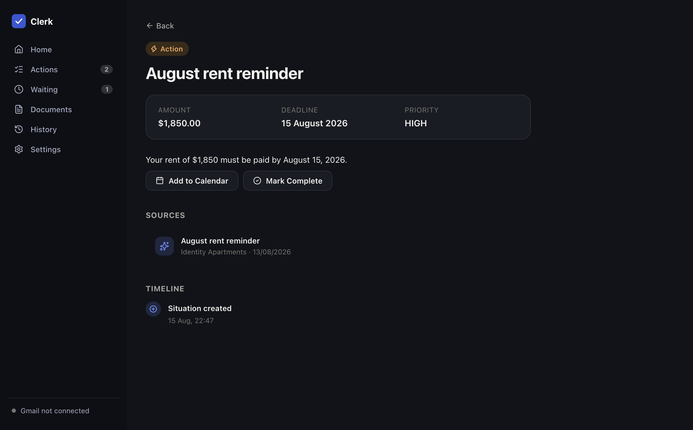

# Clerk

Your personal AI admin agent.

Clerk turns emails and documents into a small set of tracked situations: things you need to do, things you're waiting on, and things that have been resolved. It runs incoming sources through a stateful ingestion and reconciliation pipeline, so multiple messages about the same real-world issue update one persistent situation instead of generating duplicate tasks — a refund request, an acknowledgement, and a "your refund has been processed" email all become one situation with a timeline, not three unrelated cards.



## What it does

- **Reads Gmail and imported documents** (PDF, TXT, PNG, JPEG) and classifies each one as an action you need to take, something you're waiting on, a resolution to an existing situation, or purely informational.
- **Matches new messages to existing situations** using deterministic evidence first (thread ID, order/ticket numbers, sender) before falling back to a model — the matching logic is the part of this project with the heaviest test coverage, because getting it wrong means duplicate or orphaned tasks.
- **Tracks a full timeline per situation**: created, updated, resolved, added to calendar, marked complete — with source traceability back to the original email or file.
- **Never sends email, deletes anything, or touches your calendar without confirmation.** Calendar events require an explicit "Add to Calendar?" dialog; nothing else Clerk does has an external side effect beyond reading Gmail and your own imported files.



## Try it without any setup

Clerk ships with a Demo Mode that runs a fixed set of fake emails through the *real* pipeline — the same matching, classification, and reconciliation code that runs on live Gmail data, just with a deterministic classifier standing in for a model call. It's not a set of pre-built cards; the WAITING → COMPLETED transition you'll see for the demo refund situation is produced by two separate fixture emails actually getting matched and reconciled.

```bash
git clone https://github.com/Anant-Madhok231/clerk-ai.git
cd clerk-ai
npm install
npm run dev
```

Click "Get Started" → "Skip and try the demo instead" → "Start Clerk", then "Load Demo Data" from the Home screen.

## Architecture

Clerk is one conceptual agent, not a swarm of named sub-agents. The pipeline is a plain function chain, not a graph-orchestration framework — it doesn't need one yet:

```
Source (Gmail message / imported file)
  → normalize into a SourceItem
  → find candidate situations on the same thread (deterministic matching)
  → classify (DemoAIProvider or OpenAIProvider, Zod-validated output)
  → reconcile against the existing situation's state machine
  → persist to SQLite
  → push a change event to the renderer
```

```
apps/
  desktop/    Electron + React app (the actual product)
    src/main/          Node process: db, pipeline, integrations, IPC handlers
    src/preload/       Narrow contextBridge API — the only thing the renderer can call
    src/renderer/      React UI
    src/shared/        Types/schemas shared by main, preload, and renderer
  site/       Marketing site + static interactive demo (Vite, builds to /clerk-ai/)
scripts/      Icon generation
```

**Stack:** Electron, React, TypeScript (strict), Vite via electron-vite, Drizzle ORM over `better-sqlite3`, Zod for every IPC payload and every AI classification result, TanStack Query + a small `onSituationsChanged`/`onSyncStatusChanged` push-event mechanism for keeping the UI in sync with SQLite without polling, Zustand for local UI state (theme, active view, toasts).

## Situation matching and reconciliation

This is the part of the spec that actually matters. Given:

1. *"Your refund request has been received. Order #12345, $129.99."*
2. *"Your refund of $129.99 for order #12345 has been processed."*

Clerk creates one situation from message 1 (status `WAITING`), then on message 2 finds it via the shared Gmail thread ID, classifies the new message as a resolution, and updates the *same* situation to `COMPLETED` with a `STATE_CHANGED` event recording the transition — rather than creating a second, disconnected "refund processed" card. See `apps/desktop/src/main/pipeline/processSourceItem.test.ts`-adjacent tests (`processSourceItem.db.test.ts`, `runDemoIngestion.db.test.ts`) for this exact scenario asserted end to end.

The state machine itself (`apps/desktop/src/shared/domain/situation.ts`) is deliberately simple and separately tested: `COMPLETED` and `INFORMATIONAL` are terminal, `ACTION` and `WAITING` can move to anything. The pipeline calls this rather than hand-rolling status logic, so the matching/classification code never has to reason about which transitions are legal.

## AI providers

`AIProvider` is a two-method interface (`classify`). Two real implementations exist:

- **`DemoAIProvider`** — deterministic keyword/regex classification, no network call, no credentials. This is what Demo Mode and most of the test suite use.
- **`OpenAIProvider`** — calls the OpenAI Chat Completions API with a JSON-mode system prompt, validates the response against the same `ClassificationResultSchema` (Zod) either provider returns, and retries a bounded number of times on a malformed response. Requires a user-supplied API key (Settings → AI), stored via `safeStorage`, never in plaintext.

There's deliberately no third "cloud" provider stub — the interface is designed so one could be added later, but nothing speculative is implemented ahead of being used.

## Security

- `contextIsolation: true`, `nodeIntegration: false`, `sandbox: true` on every window.
- The preload script exposes a narrow, fully-typed API (`window.clerk.*`) — no raw `ipcRenderer`, `fs`, `child_process`, or `process.env` ever reaches the renderer.
- Every IPC payload is validated with Zod in the main process before it touches the database.
- OAuth tokens (Gmail, Calendar) and the OpenAI API key go through Electron's `safeStorage`, never written in plaintext. There's no `keytar` dependency — `safeStorage` has been sufficient so far, and the project's rule is to add a native credential store only if a concrete `safeStorage` limitation shows up, not preemptively.
- External links always open in the system browser, never inside the app.

See `SECURITY.md` for the vulnerability reporting process.

## Development

```bash
npm install        # installs all workspaces, rebuilds better-sqlite3 for Electron's ABI
npm run dev         # launch the desktop app
npm run lint         # eslint, repo-wide
npm run typecheck     # tsc --noEmit, main+preload and renderer as separate projects
npm test               # vitest — logic that doesn't touch SQLite
npm run test -w apps/desktop && npm run test:db -w apps/desktop  # full suite (see below)
npm run build          # production build (electron-vite)
npm run dev:site        # the marketing site, locally
```

**Why two test commands:** `better-sqlite3` is a native module compiled against Electron's own Node ABI, not the system Node used by plain `vitest run`. Tests that touch the database are named `*.db.test.ts` and run via `npm run test:db -w apps/desktop`, which executes Vitest through Electron itself (`ELECTRON_RUN_AS_NODE=1`) so the ABI matches. Everything else runs under plain `vitest run`. 71 tests total (37 that don't touch SQLite, 34 that do).

### Gmail and Calendar

Both integrations share one Google Cloud OAuth client (Desktop app type — PKCE, no client secret). Copy `apps/desktop/.env.example` to `apps/desktop/.env.local` and set `GOOGLE_OAUTH_CLIENT_ID`. Without it, Clerk runs fine in Demo Mode; Settings will just show both integrations as "Not connected."

### Packaging

```bash
npm run dist:mac -w apps/desktop   # produces Clerk-<version>-macOS-{arm64,x64}.dmg in apps/desktop/release/
npm run dist:win -w apps/desktop   # NSIS installer config — needs a Windows (or CI) runner to actually build
```

## Project status

This is a from-scratch rebuild. The product spec is in `PRODUCT_SPEC.md`; permanent working rules for anyone (human or AI) picking this repo back up are in `CLAUDE.md`. See the project's own commit history for what's implemented, mocked, or pending external credentials (Google OAuth client, OpenAI key, Apple/Windows signing) — the intent throughout has been to never claim something works without having actually run it.

## License

MIT — see `LICENSE`.
